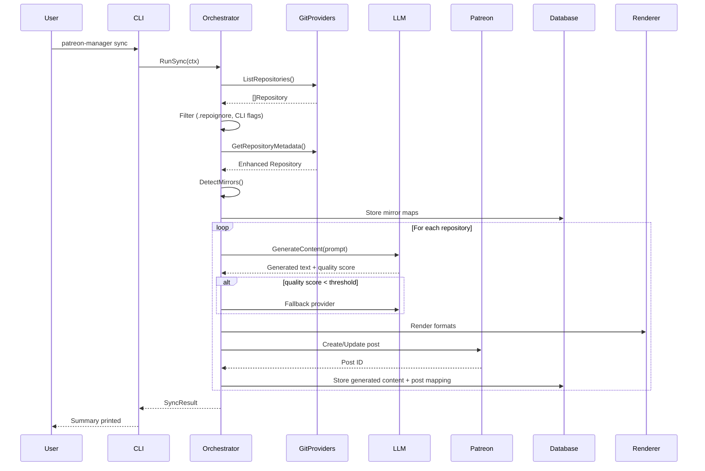
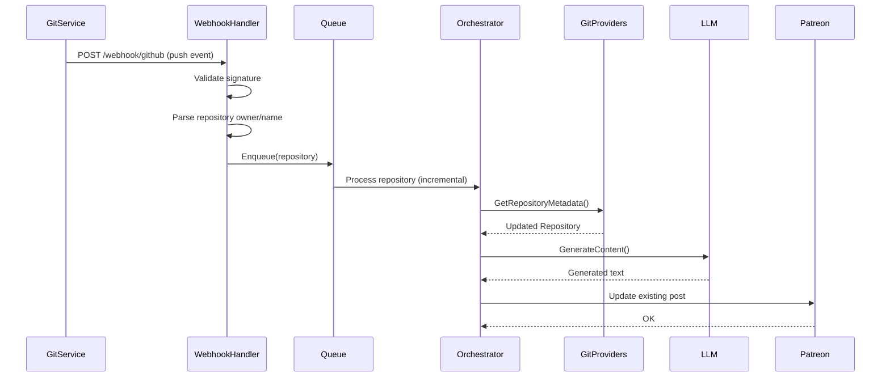
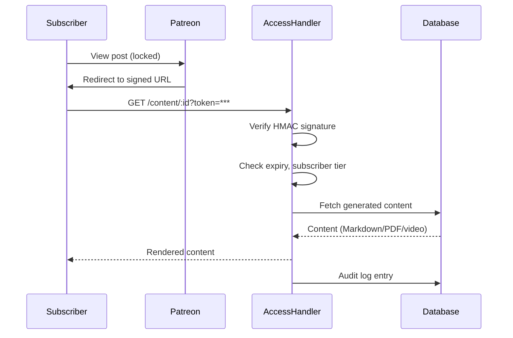

# Architecture Overview

My Patreon Manager is a Go application that orchestrates the extraction of Git repository metadata, generation of high‑quality content via LLMs, and publishing to Patreon as premium posts. This document describes the system’s components, data flow, integration points, and plugin architecture.

## System Components

### 1. **CLI (`cmd/cli/`)**

The command‑line interface provides all user‑facing operations:

- `sync` – full or incremental synchronization
- `dry‑run` – preview changes without publishing
- `server` – start the HTTP server (webhooks, metrics, admin API)
- `template` – manage content templates
- `review` – inspect and approve queued content
- `stats` – view token usage, sync statistics

The CLI parses flags, loads configuration, and delegates to the appropriate service.

### 2. **HTTP Server (`cmd/server/`)**

A lightweight Gin‑based HTTP server that exposes:

- **Webhook endpoints** (`/webhook/github`, `/webhook/gitlab`) – receive real‑time repository change notifications
- **Admin API** (`/admin/...`) – configuration reload, sync status, manual triggers
- **Metrics endpoint** (`/metrics`) – Prometheus‑format metrics
- **Health checks** (`/health`, `/health/ready`, `/health/live`)
- **Premium content access** (`/content/:id`) – signed URL validation for subscriber access

### 3. **Configuration (`internal/config/`)**

Hierarchical configuration loading:

1. CLI flags (highest priority)
2. Environment variables
3. `.env` file
4. Default values

Supports validation, secret redaction in logs, and hot‑reload (SIGHUP).

### 4. **Database Layer (`internal/database/`)**

Abstract store interfaces with SQLite and PostgreSQL implementations:

- `RepositoryStore` – Git repository metadata
- `SyncStateStore` – checkpoint/resume state
- `MirrorMapStore` – detected cross‑service mirrors
- `GeneratedContentStore` – LLM‑generated content
- `PostStore` – Patreon post mappings
- `AuditEntryStore` – audit trail of all operations
- `ContentTemplateStore` – custom content templates

The database layer also provides distributed locking (via PostgreSQL advisory locks or SQLite file locks) and transaction support.

### 5. **Git Providers (`internal/providers/git/`)**

Plugin‑style providers for each supported Git service:

- **GitHub** – uses official Go client with Personal Access Token
- **GitLab** – uses go‑gitlab client with API token
- **GitFlic** – custom REST client (Russian Git hosting)
- **GitVerse** – custom REST client (Russian Git hosting)

Each provider implements the `RepositoryProvider` interface:

```go
type RepositoryProvider interface {
    Authenticate(token string) error
    ListRepositories(ctx context.Context, opts ListOptions) ([]Repository, error)
    GetRepositoryMetadata(ctx context.Context, owner, name string) (*Repository, error)
    CheckRepositoryState(ctx context.Context, repo *Repository) (*RepositoryState, error)
    DetectMirrors(ctx context.Context, repos []Repository) ([]MirrorGroup, error)
}
```

Providers can be chained for fallback (e.g., primary GitHub token, secondary GitHub token) and are protected by circuit breakers.

### 6. **LLM Integration (`internal/providers/llm/`)**

Abstraction over the external **LLMsVerifier** service that normalizes multiple LLM providers (OpenAI, Anthropic, Cohere, etc.) into a single interface:

- `GenerateContent` – send a prompt, receive generated text and quality score
- `GetAvailableModels` – list models with capabilities and cost‑per‑token
- `GetModelQualityScore` – model‑specific quality score (0.0–1.0)

Includes a **fallback chain** (primary → fallback1 → fallback2) and **circuit breakers** to disable failing providers temporarily.

### 7. **Patreon Client (`internal/providers/patreon/`)**

OAuth2‑authenticated client for the Patreon API:

- Campaign listing
- Post creation/update/archive
- Tier association
- Webhook management (for post comments/likes)

Handles token refresh automatically and respects rate limits.

### 8. **Renderer System (`internal/providers/renderer/`)**

Converts raw generated text into output formats:

- **Markdown** – primary format for Patreon posts
- **PDF** – headless Chrome rendering of Markdown (optional)
- **Video script** – structured script for TTS/video pipelines (optional)

Each renderer implements the `FormatRenderer` interface and can be enabled/disabled via configuration.

### 9. **Sync Orchestrator (`internal/services/sync/`)**

The core synchronization engine that coordinates the 8‑stage pipeline:

1. **Repository Discovery** – list repositories from all configured Git providers
2. **Filtering** – apply `.repoignore`, selective filters (`--org`, `--repo`, `--since`)
3. **Mirror Detection** – group identical repositories across services, pick canonical
4. **Metadata Enhancement** – fetch detailed metadata (README, topics, last commit)
5. **Content Generation** – apply template, call LLM, quality gate, render formats
6. **Quality Gate** – evaluate quality score, fallback if needed, queue for review on failure
7. **Patreon Mapping** – map repository to Patreon campaign/tier, check for existing post
8. **Publishing** – create/update/archive Patreon posts, store audit trail

The orchestrator supports **checkpoint/resume** – if a sync is interrupted, it can resume from the last successful stage.

### 10. **Filtering Engine (`internal/services/filter/`)**

Applies inclusion/exclusion rules:

- **`.repoignore`** – gitignore‑like patterns (global and per‑service)
- **CLI filters** (`--org`, `--repo`, `--pattern`, `--since`, `--changed‑only`)
- **URL normalization** – convert HTTPS/SCP formats to consistent `git@host:owner/repo.git`

### 11. **Content Generation (`internal/services/content/`)**

Manages the LLM interaction loop:

- **Prompt assembly** from template and repository metadata
- **Token budget** – daily limit with hard stop at 100%
- **Quality gate** – threshold‑based acceptance (default 0.75)
- **Fallback chain** – try next LLM provider if quality score is low
- **Review queue** – manual inspection for failed content

### 12. **Access Control (`internal/services/access/`)**

Handles premium content delivery to subscribers:

- **Signed URLs** – HMAC‑signed tokens with expiry and subscriber ID
- **Tier gating** – verify subscriber’s tier matches post requirements
- **Audit logging** – record all access attempts

### 13. **Audit System (`internal/services/audit/`)**

Records every significant action (sync start/end, post created, token refresh, error) for compliance and debugging.

### 14. **Metrics (`internal/metrics/`)**

Prometheus metrics for monitoring:

- Sync duration, repository count, token usage
- LLM provider latency, circuit‑breaker state
- Webhook request rate, deduplication rate
- Database query latency, lock contention

### 15. **Middleware (`internal/middleware/`)**

HTTP middleware chain:

- **Logger** – structured request logging
- **Recovery** – panic recovery, 500 error conversion
- **Rate limit** – per‑IP and global limiters
- **Auth** – API key validation, webhook signature verification

## Data Flow

### Full Sync Flow



### Webhook‑Driven Incremental Sync



### Premium Content Access Flow



## Integration Points

### External Services

| Service | Purpose | Authentication |
|---------|---------|----------------|
| **GitHub** | Repository listing, metadata, webhooks | Personal Access Token (PAT) |
| **GitLab** | Repository listing, metadata, webhooks | API token |
| **GitFlic** | Repository listing, metadata | API key |
| **GitVerse** | Repository listing, metadata | API key |
| **LLMsVerifier** | LLM abstraction, quality scoring | API key (per provider) |
| **Patreon** | Post creation, tier mapping, subscriber info | OAuth2 (Client ID + Secret + Refresh Token) |
| **PostgreSQL** | Persistent state (optional) | Username/password |
| **Redis** | Distributed locking, rate‑limiting state (optional) | (none) |

### Configuration Files

- **`.env`** – credentials and feature flags
- **`.repoignore`** – repository exclusion patterns
- **`templates/`** – custom content templates
- **`migrations/`** – database schema migrations

## Plugin Architecture

The system is designed for extensibility through interfaces:

### Adding a New Git Provider

1. Implement `RepositoryProvider` interface.
2. Register the provider in `internal/providers/git/factory.go`.
3. Add configuration variables (`*_TOKEN`, `*_BASE_URL`).
4. Create unit and integration tests.

### Adding a New Renderer

1. Implement `FormatRenderer` interface.
2. Register in `internal/providers/renderer/factory.go`.
3. Add enable flag (`ENABLE_*_RENDERING`).
4. Add output directory configuration.

### Adding a New LLM Provider

LLM providers are added **outside** the manager – they are integrated via the external **LLMsVerifier** service. Update the LLMsVerifier configuration to include the new provider.

### Adding a New Database Backend

1. Implement `Database` interface and all store interfaces.
2. Register in `internal/database/factory.go`.
3. Add migration system (SQL files or Go migrations).
4. Update `DB_DRIVER` configuration.

## Deployment Topologies

### Single‑Instance CLI

- One binary, scheduled via cron.
- SQLite database.
- Suitable for personal use.

### Docker Container

- Consistent environment.
- SQLite or PostgreSQL.
- HTTP server for webhooks/metrics.
- External cron triggers syncs.

### Kubernetes Cluster

- High availability (multiple HTTP instances).
- PostgreSQL for shared state.
- CronJob for scheduled syncs.
- Ingress for webhooks/admin API.

## Scaling Considerations

### Vertical Scaling

- Increase `MAX_CONCURRENT_REPOS` to process more repositories in parallel.
- Increase `LLM_MAX_CONCURRENT_REQUESTS` for faster LLM generation.
- Use faster LLM models (e.g., GPT‑4) for higher quality (higher cost).

### Horizontal Scaling

- **HTTP layer** – stateless, can run multiple replicas behind a load balancer.
- **Sync layer** – must be single‑writer; use distributed locking (PostgreSQL/Redis).
- **Database** – PostgreSQL with read replicas for read‑heavy workloads.

### Performance Bottlenecks

1. **LLM API latency** – the slowest part of the pipeline; use caching (`LLM_CACHE_ENABLED`).
2. **Git provider rate limits** – use secondary tokens, respect Retry‑After headers.
3. **PDF rendering** – CPU‑intensive; consider disabling or using a dedicated worker pool.
4. **Database I/O** – use indexes, connection pooling, and consider moving to PostgreSQL for high write loads.

## Security Model

### Credential Storage

- Tokens stored in `.env` file (never committed).
- Secrets redacted in logs (even at TRACE level).
- Optional encryption‑at‑rest for database (via PostgreSQL or filesystem encryption).

### Authentication & Authorization

- **Git providers** – PAT/API token.
- **Patreon** – OAuth2 with refresh token rotation.
- **LLMsVerifier** – API key.
- **Admin API** – static API key (`ADMIN_API_KEY`).
- **Webhooks** – HMAC signature verification.

### Audit Trail

All actions are logged to the audit table with:
- Timestamp, actor (system/user/IP), event type, outcome.
- Full request/response details for troubleshooting.
- Retention configurable via `AUDIT_RETENTION_DAYS`.

## Monitoring & Observability

### Logs

Structured JSON logs with correlation IDs for tracing requests across components.

### Metrics

Prometheus metrics exposed at `/metrics`; alert on:
- Sync failure rate
- Token budget exhaustion
- Circuit‑breaker trips
- High latency percentiles

### Health Checks

Liveness, readiness, and startup probes for container orchestration.

## Conclusion

My Patreon Manager is a modular, extensible system built with production‑grade resilience patterns (circuit breakers, fallbacks, checkpoint/resume, distributed locking). Its plugin architecture allows new Git providers, renderers, and databases to be added with minimal changes to core logic.

For detailed API documentation, see the [OpenAPI specification](../api/openapi.yaml). For deployment instructions, see the [Deployment Guide](../guides/deployment.md).