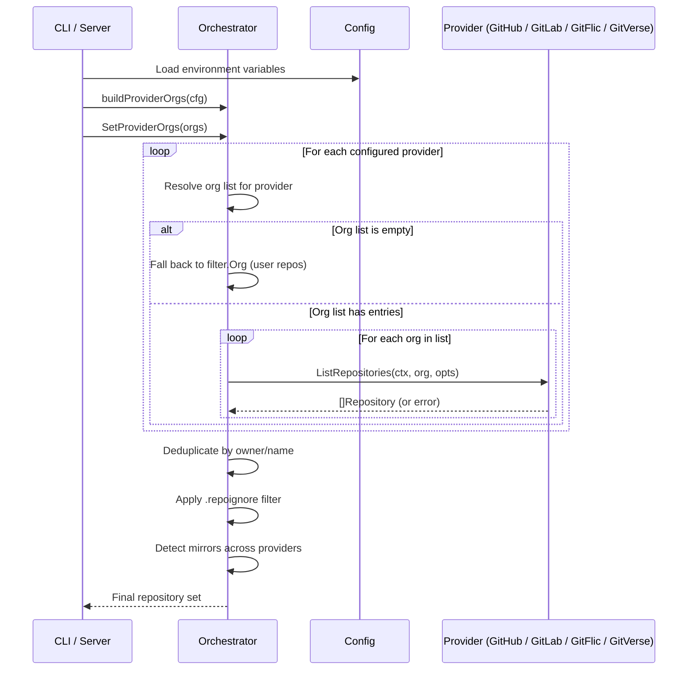
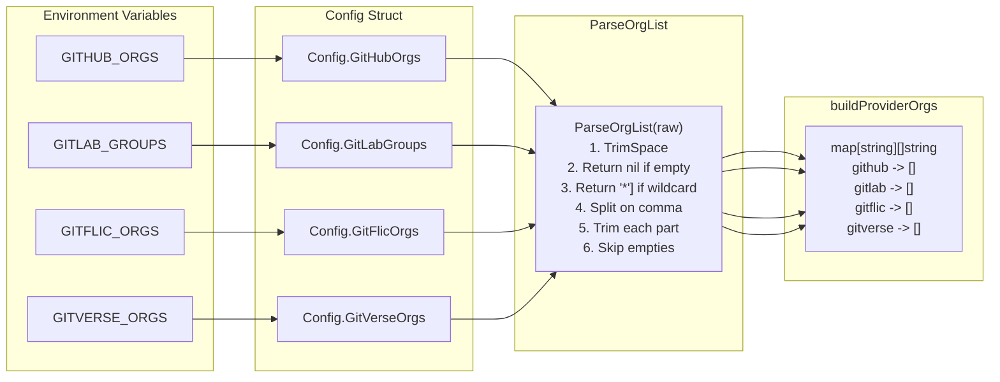
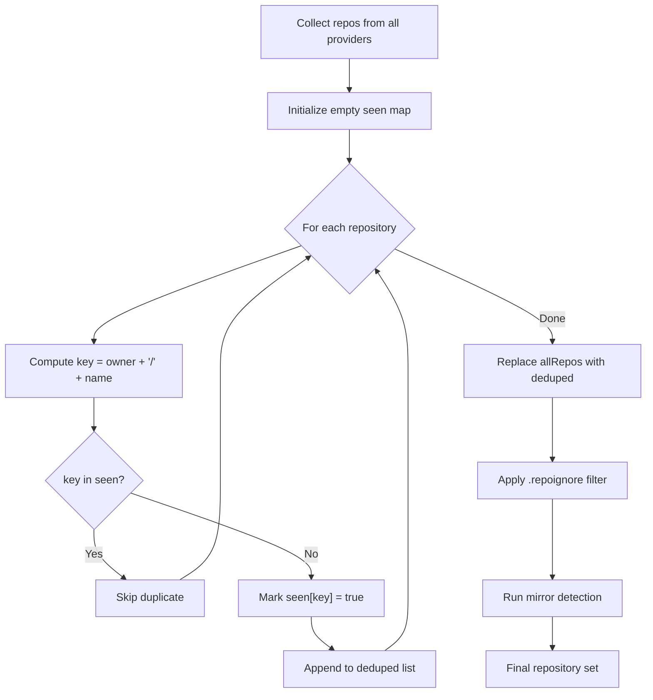
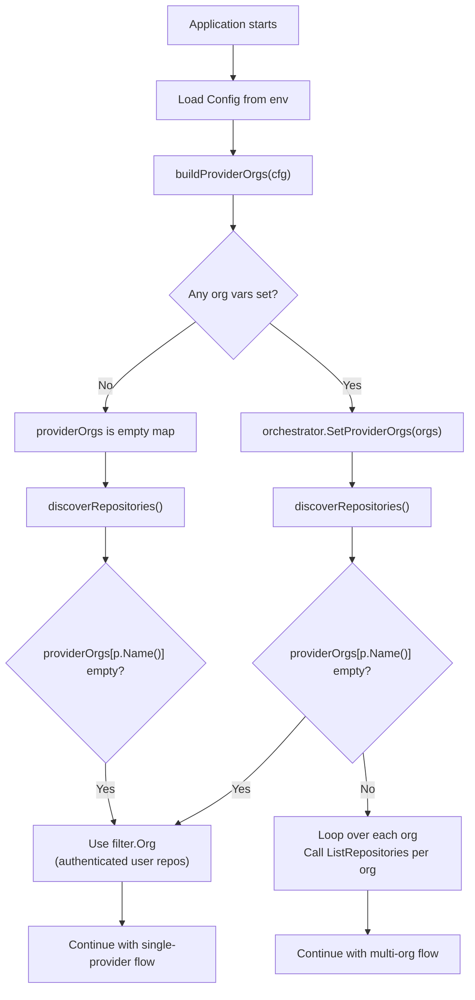

# Multi-Organization Support

## Overview

My-Patreon-Manager scans Git repositories across four hosting platforms -- GitHub, GitLab, GitFlic, and GitVerse -- and generates tier-gated Patreon content from them. By default, each provider scans only the authenticated user's personal repositories.

Multi-org support extends this to scan repositories belonging to one or more organizations or groups on each platform. You configure this through comma-separated environment variables. The system:

- Parses org lists from environment variables at startup.
- Iterates over every configured provider and every specified organization.
- Deduplicates repositories by `owner/name` to handle mirrors across platforms.
- Falls back to user-only repositories when no orgs are configured, preserving full backward compatibility.

---

## Architecture

### Multi-Org Discovery Flow

The orchestrator walks every configured provider and every organization in its list, collecting repositories into a unified set. Errors from individual providers are captured without aborting the run.



### Provider Configuration Mapping

Environment variables are loaded into the `Config` struct, then parsed by `ParseOrgList` in `internal/providers/git/provider_config.go`. The result is a `map[string][]string` keyed by provider name.



### Repository Deduplication

After collecting repositories from all providers and organizations, the orchestrator deduplicates by `owner/name` key. The first occurrence wins; subsequent duplicates are silently dropped.



### Backward Compatibility

When no organization environment variables are set, the system behaves identically to the single-org release. The `buildProviderOrgs` function returns an empty map, and `SetProviderOrgs` is never called.



---

## Environment Variables

| Variable | Type | Default | Format | Description |
|----------|------|---------|--------|-------------|
| `GITHUB_ORGS` | `string` | *(empty)* | Comma-separated org names | GitHub organizations to scan |
| `GITLAB_GROUPS` | `string` | *(empty)* | Comma-separated group names | GitLab groups to scan (includes subgroups) |
| `GITFLIC_ORGS` | `string` | *(empty)* | Comma-separated org names | GitFlic organizations to scan |
| `GITVERSE_ORGS` | `string` | *(empty)* | Comma-separated org names | GitVerse organizations to scan |

### Parsing Rules

The `ParseOrgList` function (`internal/providers/git/provider_config.go`) applies these rules:

| Input | Output | Behavior |
|-------|--------|----------|
| `""` or unset | `nil` | No orgs; provider scans user repos only |
| `"*"` | `["*"]` | Wildcard; intended for "all orgs" (not yet implemented) |
| `"org1"` | `["org1"]` | Single organization |
| `"org1,org2,org3"` | `["org1", "org2", "org3"]` | Multiple organizations |
| `" org1 , org2 "` | `["org1", "org2"]` | Whitespace is trimmed |
| `" , , "` | `nil` | All-empty parts are discarded |

---

## Configuration Examples

### Single Organization on One Provider

```sh
GITHUB_TOKEN=ghp_***
GITHUB_ORGS=my-company
```

Scans all repositories in the `my-company` GitHub organization. The authenticated user's personal repositories are also included if `filter.Org` resolves to the user.

### Multiple Organizations per Provider

```sh
GITHUB_TOKEN=ghp_***
GITHUB_ORGS=company-org,open-source-team

GITLAB_TOKEN=glpat-***
GITLAB_GROUPS=engineering,design,devops
```

Scans two GitHub organizations and three GitLab groups. Each organization and group is queried independently.

### All Four Platforms

```sh
GITHUB_TOKEN=ghp_***
GITHUB_ORGS=company-org,oss-projects

GITLAB_TOKEN=glpat-***
GITLAB_GROUPS=backend-team,frontend-team

GITFLIC_TOKEN=***
GITFLIC_ORGS=mirrors,internal

GITVERSE_TOKEN=***
GITVERSE_ORGS=public-projects
```

Repositories from every platform are collected, deduplicated by `owner/name`, and processed as a single unified set.

### User Repositories Only (No Orgs)

```sh
GITHUB_TOKEN=ghp_***

GITLAB_TOKEN=glpat-***
```

With no `*_ORGS` variables set, the system falls back to scanning only the authenticated user's personal repositories on each platform. This is the default and is fully backward compatible.

### Mixed: Orgs on Some Platforms, User Repos on Others

```sh
GITHUB_TOKEN=ghp_***
GITHUB_ORGS=work-org

GITLAB_TOKEN=glpat-***
# GITLAB_GROUPS is not set
```

GitHub scans the `work-org` organization. GitLab scans only the user's personal projects.

---

## Provider-Specific Behavior

| Provider | Environment Variable | API Pattern | Recursive | Token Failover | Notes |
|----------|---------------------|-------------|-----------|----------------|-------|
| GitHub | `GITHUB_ORGS` | `/orgs/{org}/repos` | No | Yes (`GITHUB_TOKEN_SECONDARY`) | Requires `repo` and `read:org` scopes |
| GitLab | `GITLAB_GROUPS` | `/groups/{group}/projects` | Yes (`IncludeSubGroups: true`) | Yes (`GITLAB_TOKEN_SECONDARY`) | Works with `GITLAB_BASE_URL` for self-hosted instances |
| GitFlic | `GITFLIC_ORGS` | `/orgs/{org}/repos` | No | Yes (`GITFLIC_TOKEN_SECONDARY`) | Queries organization repos endpoint |
| GitVerse | `GITVERSE_ORGS` | `/orgs/{org}/repos` | No | Yes (`GITVERSE_TOKEN_SECONDARY`) | Queries organization repos endpoint |

### Token Requirements

Each provider requires a primary token with sufficient permissions to list organization repositories:

| Provider | Primary Token | Minimum Scope |
|----------|--------------|---------------|
| GitHub | `GITHUB_TOKEN` | `repo`, `read:org` |
| GitLab | `GITLAB_TOKEN` | `read_api` or `api` |
| GitFlic | `GITFLIC_TOKEN` | Organization read access |
| GitVerse | `GITVERSE_TOKEN` | Organization read access |

Secondary tokens are attempted automatically when the primary token returns an authentication or authorization error for a given organization.

---

## Deduplication and Mirror Detection

### Deduplication

When repositories are collected from multiple organizations across multiple providers, the same repository may appear more than once. This happens when:

- A repository is mirrored across platforms (e.g., GitHub mirror of a GitLab project).
- An organization contains a fork that also exists in another scanned org.

The orchestrator deduplicates by computing a key of `owner/name` for each repository and keeping only the first occurrence. The deduplication step runs after all providers have been queried and before `.repoignore` filtering and mirror detection.

### Mirror Detection

After deduplication, the orchestrator runs `git.DetectMirrors` to identify repositories that are mirrors of each other across platforms. Mirror detection uses three strategies:

1. **Exact name match** -- repositories with identical names across providers.
2. **README hash comparison** -- repositories with identical README content hashes.
3. **Commit SHA comparison** -- repositories sharing recent commit SHAs.

Detected mirrors are grouped, and mirror URLs are attached to each repository for downstream rendering. This ensures that Patreon posts can display links to all platform mirrors.

---

## Backward Compatibility

Multi-org support is fully backward compatible. The migration path is intentional:

- **All `*_ORGS` variables are optional.** If none are set, `buildProviderOrgs` returns an empty map, and `SetProviderOrgs` is never called.
- **Provider behavior is unchanged.** When no orgs are configured for a provider, `discoverRepositories` falls back to `filter.Org`, which resolves to the authenticated user.
- **No configuration changes are required.** Existing `.env` files and deployments continue to work without modification.
- **The `SetProviderOrgs` call is guarded.** In `cmd/cli/main.go`, the call only executes when at least one provider has a non-empty org list:

```go
if providerOrgs := buildProviderOrgs(cfg); len(providerOrgs) > 0 {
    orchestrator.SetProviderOrgs(providerOrgs)
}
```

---

## Security Considerations

### Token Scoping

Each token should be scoped to the minimum permissions required:

- GitHub tokens need `repo` (for private repo read) and `read:org` (to list org membership).
- GitLab tokens need `read_api` at minimum; `api` grants broader access than necessary.
- Secondary tokens are a fallback mechanism, not a privilege escalation path. Both primary and secondary tokens should have equivalent access to the same organizations.

### Organization Access Control

- The system can only scan organizations where the authenticated token has explicit access.
- If a token lacks access to a named organization, the provider returns an error for that organization and continues with the remaining ones. The error is logged and appended to the sync result's error list.
- No error is raised for organizations that do not exist or are inaccessible -- the error is captured and the run continues.

### Credential Isolation

- Organization names are not secrets. They appear in logs and sync reports.
- Tokens are redacted in all log output via `internal/utils/redact.go`.
- Never commit tokens to version control. Use `.env` (gitignored) or environment variables.

---

## Troubleshooting

| Symptom | Likely Cause | Resolution |
|---------|-------------|------------|
| No repos from a specific org | Token lacks `read:org` scope | Verify token permissions on the platform's settings page |
| Duplicate repos in output | Same repo name under different owners | Deduplication uses `owner/name`; different owners are treated as distinct repos |
| Org repos missing, user repos present | `*_ORGS` variable not loaded | Confirm the variable is set in `.env` or the process environment |
| Partial results (some orgs missing) | Token lacks access to specific orgs | Check error output; use secondary token with broader access |
| Wildcard `*` has no effect | Wildcard not yet implemented | Use explicit org names instead |
| `failed to load .repoignore` | Malformed `.repoignore` file | Check `.repoignore` syntax; the file is optional |
| Mirror detection errors | Network timeout during cross-provider comparison | Non-fatal; mirrors are best-effort and do not block the sync |

### Verifying Configuration

Use the `validate` command to check that configuration is loaded correctly:

```sh
go run ./cmd/cli validate
```

Use the `scan` command with `--dry-run` to preview which repositories would be discovered without performing any writes:

```sh
go run ./cmd/cli scan --dry-run
```

### Debug Logging

Set `LOG_LEVEL=DEBUG` to see per-provider, per-organization query details:

```sh
LOG_LEVEL=DEBUG go run ./cmd/cli scan --dry-run
```

---

## Migration from Single-Org

### Step 1: Verify Current Configuration

Confirm your current setup works with user-only scanning:

```sh
go run ./cmd/cli scan --dry-run
```

### Step 2: Add Organization Variables

Add one or more `*_ORGS` variables to your `.env` file. Start with a single organization to validate access:

```sh
GITHUB_ORGS=my-first-org
```

### Step 3: Test with Dry Run

Run a dry-run scan to verify the new organization is discovered:

```sh
go run ./cmd/cli scan --dry-run
```

Review the output for the expected repositories from the new organization.

### Step 4: Expand to Additional Organizations

Once confirmed, add additional organizations or enable other providers:

```sh
GITHUB_ORGS=org-one,org-two
GITLAB_GROUPS=engineering-team
GITFLIC_ORGS=mirrors
GITVERSE_ORGS=public-projects
```

### Step 5: Run a Full Sync

Execute a full sync to generate and publish content:

```sh
go run ./cmd/cli sync --dry-run   # preview changes
go run ./cmd/cli sync             # apply changes
```

### Rollback

To revert to user-only scanning, remove or comment out the `*_ORGS` variables:

```sh
# GITHUB_ORGS=org-one,org-two
```

No other configuration changes are required. The system will resume scanning only the authenticated user's personal repositories.
